# Reporte integral del ERP SunNutrition

**Fecha del relevamiento:** 18 de julio de 2026  
**Alcance:** funcionamiento integral de la aplicación, pestañas, circuitos operativos, modelo de datos, cálculos financieros y calidad del dato.  
**Estado analizado:** código y caché central existentes en `C:\Users\benja\Documents\ERP`.  
**Naturaleza del documento:** auditoría independiente con seguimiento de correcciones aplicadas en la app y su caché derivada.

### Correcciones aplicadas el 18/07/2026

- Se corrigió la interpretación de cantidades decimales del inventario durante su valuación. No se modificaron cantidades ni precios unitarios de origen.
- Se recalcularon los valores derivados de `detalle_inventarios` e `inventarios`: el máximo bajó de **$ 3.973.476.470,93** a **$ 59.974.860,70**.
- El inventario inicial del Estado de Resultados ahora toma el último inventario disponible anterior al período, aunque no pertenezca al mes inmediatamente anterior.
- El cashflow ahora parte de la fecha actual de Argentina, en lugar de una fecha fija.

---

## 1. Resumen ejecutivo

La aplicación ya cubre una porción amplia de la operación de SunNutrition: compras, recepciones, inventarios por turno, pedidos, logística, ventas, cobranzas, pagos, cheques, sueldos, conciliación bancaria, estado de resultados y cashflow. El diseño funcional general es consistente con un ERP liviano: los hechos operativos se registran primero y los reportes deberían derivarse de ellos.

El principal problema actual no es la cantidad de funciones disponibles, sino la **confiabilidad y trazabilidad de la información**. El sistema combina tres niveles que todavía no están completamente separados:

1. Google Sheets como origen histórico y, en algunos casos, destino de carga.
2. Un caché JSON central que normaliza, corrige y completa relaciones.
3. Ediciones locales hechas desde la app, algunas persistidas solo en el caché.

Esto permite que varias pantallas funcionen, pero también genera riesgos: una actualización desde Google Sheets puede reemplazar cambios locales; algunas relaciones parecen correctas solo porque el backend las reconstruye; y ciertos reportes pueden variar según qué fuente se haya refrescado por última vez.

### Conclusiones más importantes

| Prioridad | Conclusión | Evidencia actual |
|---|---|---|
| Corregida | La valuación de inventario interpretaba algunos puntos decimales como separadores de miles. | Inventario máximo corregido: **$ 59.974.860,70** frente a una mediana de **$ 27.075.162,99**. |
| Crítica | No hay una única fuente de verdad transaccional. | El editor guarda en caché; el refresco vuelve a leer Google Sheets; inventario todavía escribe directamente en Sheets. |
| Alta | El circuito bancario todavía no puede cerrar una conciliación real. | `movimientos_bancarios` y `datos_bancarios` tienen **0 filas**. |
| Alta | La clasificación contable no está gobernada por la tabla maestra. | Las **33 etiquetas** tienen `categoria_pnl` vacía; el P&L usa nombres codificados en el servidor. |
| Alta | La relación sueldo-egreso está incompleta y hay posibles duplicados. | **968 sueldos sin `id_egreso`** y **93 grupos** repetidos por empleado y mes. |
| Alta | Hay inconsistencias entre ventas y su composición monetaria. | **537 ventas** no cumplen la igualdad simple `subtotal + IVA = total`; requiere definir retenciones/percepciones dentro del modelo. |
| Corregida | El cashflow envejecía con el tiempo por usar una fecha fija. | Ahora utiliza la fecha actual del servidor en zona horaria de Argentina. |
| Media | Hay relaciones maestras huérfanas o vacías. | 25 relaciones acreedor-etiqueta apuntan a etiquetas inexistentes; 28 relaciones insumo-proveedor no tienen proveedor. |
| Media | El código concentra demasiadas responsabilidades. | `app.js` supera 523 KB y `server.js` supera 254 KB. |

### Evaluación general

- **Cobertura funcional:** alta.
- **Madurez del modelo de datos:** media.
- **Trazabilidad contable:** media-baja.
- **Calidad actual de datos:** irregular.
- **Capacidad para operar como ERP multiusuario confiable:** todavía limitada.
- **Potencial de mejora sin rehacer la interfaz:** alto.

La recomendación central es conservar el trabajo visual y funcional, pero establecer una base transaccional única y auditable. Google Sheets debería quedar como mecanismo de importación, exportación o consulta auxiliar, no como fuente simultánea de lectura y escritura para operaciones activas.

---

## 2. Metodología y límites

El relevamiento se realizó sobre:

- `index.html`: estructura visual y pestañas.
- `assets/js/app.js`: navegación, formularios, renderizados y cálculos de interfaz.
- `server.js`: API, normalizaciones, reportes, Google Sheets y reglas de negocio.
- `backend/table-registry.json`: catálogo de tablas y fuentes.
- `tmp/backend-data-cache.json`: fotografía real de los datos procesados.
- Historial funcional expresado durante la construcción de la aplicación.

Se ejecutó una auditoría de solo lectura que revisa:

- cantidad de filas y columnas;
- columnas completamente vacías;
- claves primarias vacías o repetidas;
- claves foráneas vacías o huérfanas;
- posibles duplicados de negocio;
- saldos de ventas y egresos;
- enlaces entre hechos operativos y egresos;
- valuación de inventario;
- cobertura de datos maestros.

El resultado reproducible está en:

`docs/AUDITORIA_DATOS_ERP_2026-07-18.json`

### Distinción usada en este informe

- **Lógica deseada:** criterio funcional definido para la empresa.
- **Lógica implementada:** comportamiento verificado en el código actual.
- **Dato observado:** contenido presente en el caché al 18/07/2026.
- **Riesgo:** diferencia entre esas tres capas.

---

## 3. Arquitectura actual

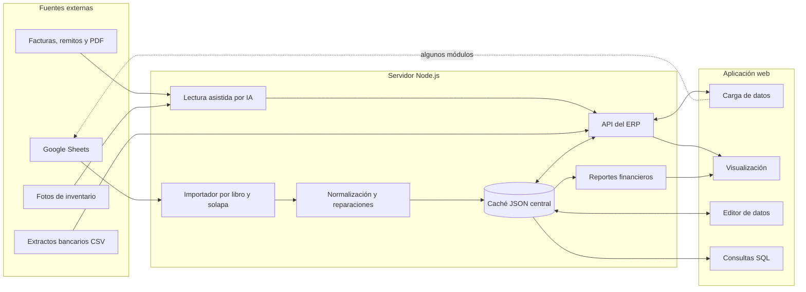

### Lectura de la arquitectura

1. El refresco de backend lee las solapas configuradas de Google Sheets.
2. Si una solapa tiene errores o no se puede leer, conserva su versión anterior.
3. El backend normaliza nombres de columnas y ejecuta múltiples reparaciones históricas.
4. El resultado completo se guarda en un único archivo JSON de aproximadamente 20 MB.
5. Las pantallas consultan ese caché mediante API.
6. El editor de datos modifica el caché, pero un refresco posterior puede volver a cargar la tabla desde Google Sheets.
7. Inventario conserva un circuito especial que escribe directamente en Google Sheets.

### Riesgo arquitectónico principal

La aplicación no define de forma inequívoca cuál es la fuente final de verdad. Una operación puede existir:

- solo en Google Sheets;
- solo en el caché;
- en ambos, pero con versiones diferentes;
- reconstruida por una regla automática del backend.

Mientras esto continúe, un dato correcto en pantalla no garantiza que esté correctamente persistido ni que sobreviva al siguiente refresco.

---

## 4. Mapa funcional de pestañas

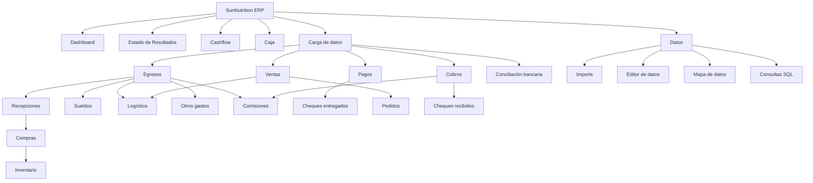

Las entradas repetidas de Logística y Comisiones son accesos al mismo módulo, no módulos duplicados.

---

## 5. Circuitos integrales de negocio

### 5.1 Compras, recepción, egreso y pago

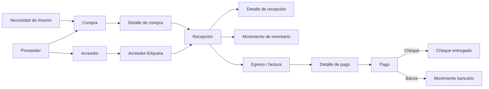

**Principio contable recomendado:**

- La compra representa el pedido al proveedor.
- La recepción representa el hecho económico y físico de recibir mercadería.
- El egreso representa el documento pagable.
- El pago cancela total o parcialmente uno o más egresos.
- El movimiento bancario prueba la salida real de fondos.

**Situación actual:** las 188 recepciones están vinculadas a egresos, pero el circuito todavía depende de reparaciones de backend para resolver acreedores y etiquetas en algunos registros.

### 5.2 Pedido, entrega, venta y cobro

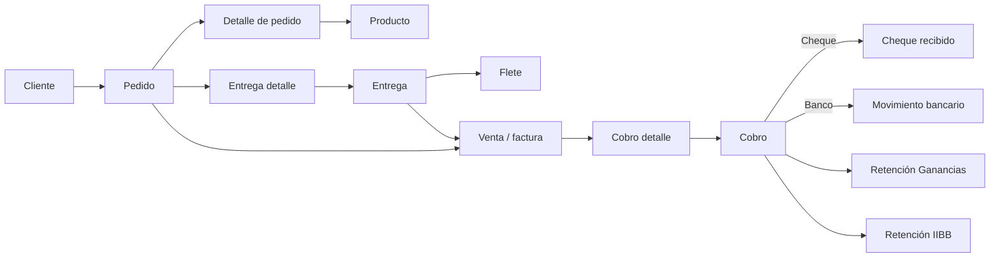

**Situación actual:**

- Hay 1.006 pedidos, 1.037 detalles y 1.024 ventas.
- Hay 2 pedidos sin venta.
- No hay pedidos sin entrega según la relación actual.
- Existen 72 ventas con saldo pendiente por un total de aproximadamente $ 88,55 millones.
- Hay 537 ventas cuya composición monetaria requiere revisión.

### 5.3 Inventario y producción

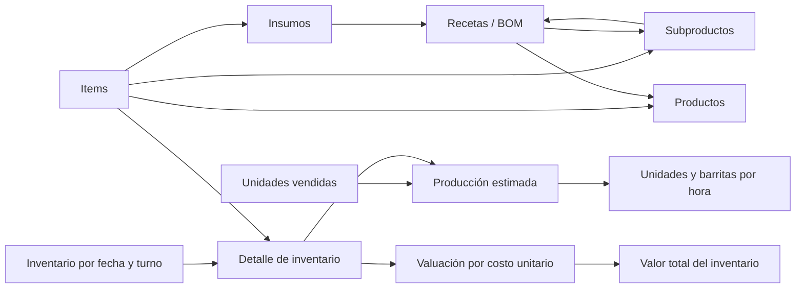

**Fórmula de producción implementada:**

`unidades vendidas + unidades de producto final - unidades de producto inicial`

**Fórmula de costo de mercadería implementada:**

`inventario inicial valorizado + compras/recepciones de mercadería - inventario final valorizado`

**Estado posterior a la corrección:** se reparó el parser de cantidades y se recalcularon los importes derivados. El mayor inventario valorizado quedó en **$ 59.974.860,70**. Aún corresponde revisar las 761 líneas con cantidad positiva y costo unitario cero.

### 5.4 Sueldos y costo laboral

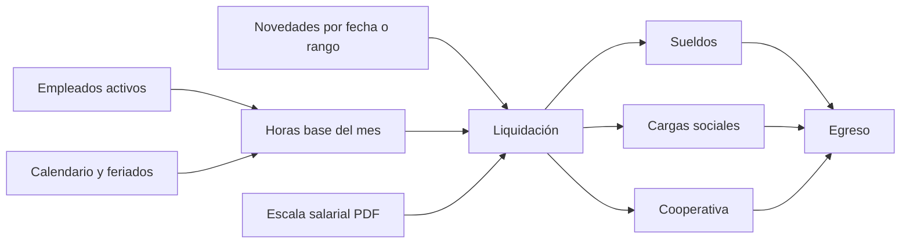

La pestaña busca actualizar horas diarias y excepciones, calcular remunerativos/no remunerativos, bruto, neto, cargas sociales y cooperativa. El enfoque es correcto, pero los datos históricos muestran 93 grupos potencialmente duplicados y ningún sueldo vinculado a `id_egreso` en la fotografía auditada.

### 5.5 Conciliación bancaria

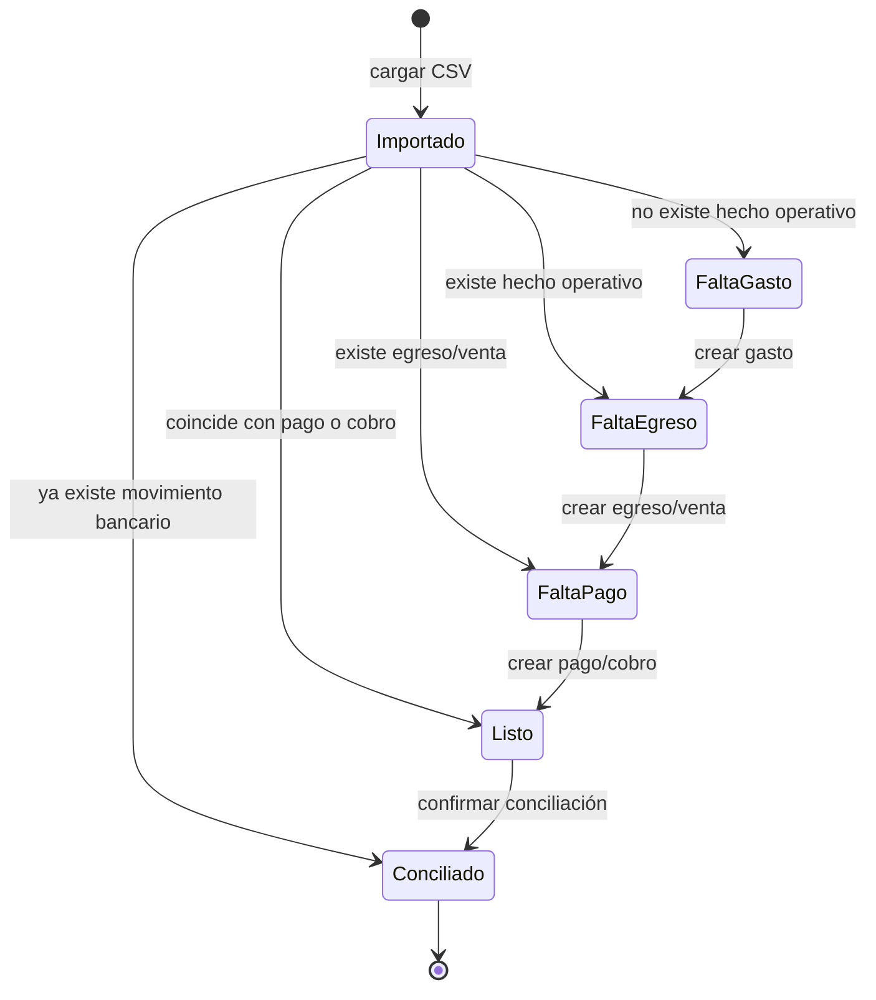

Este es el circuito adecuado conceptualmente. Sin embargo, las tablas persistentes `movimientos_bancarios` y `datos_bancarios` están vacías, por lo que todavía no existe memoria operativa para reconocer conciliaciones anteriores ni reglas estables de identificación.

---

## 6. Funcionamiento de cada pestaña

### 6.1 Dashboard

**Objetivo:** mostrar alertas operativas rápidas.

**Widgets actuales:**

- Cheques a cubrir.
- Días de inventario faltantes.
- Compras realizadas aún no recibidas.
- Pedidos aún no entregados.

**Lecturas principales:** `cheques_entregados`, `pagos`, `detalle_pagos`, `egresos`, `inventarios`, `compras`, `recepciones`, `pedidos`, `entregas_detalle`.

**Lógica:** cada widget resume una excepción y se expande o dirige al módulo correspondiente.

**Riesgos:**

- Si el acreedor no se resuelve por el circuito fuente, un cheque puede aparecer “sin acreedor”.
- No existe un indicador visible de última actualización global de datos.
- Las alertas dependen del buen estado de relaciones, no solo de fechas y montos.

**Mejora recomendada:** mostrar en cada widget fecha de actualización, origen de datos y cantidad de registros con relaciones incompletas.

### 6.2 Estado de Resultados

**Objetivo:** resultado mensual económico, independiente del momento del pago.

**Fuentes actuales:**

- Facturación: `ventas.subtotal` por `fecha_factura`.
- Unidades: `detalle_pedidos.cantidad_cajas × productos.cantidad_individual`.
- Recepciones: mercadería.
- Entregas: logística.
- Sueldos: costo laboral.
- Otros gastos: gastos operativos/no operativos.
- Comisiones: tabla de comisiones o cálculo por canal.
- Inventario: costo de mercadería vendida.

**Fórmulas relevantes:**

- Ingresos Brutos: 1,5 % del subtotal de facturas A/B.
- Comisiones: subtotal × comisión del canal.
- Mercadería: inventario inicial + compras productivas - inventario final.
- Utilidad bruta: facturación - costo de ventas.
- Utilidad operativa: utilidad bruta - gastos operativos.
- Utilidad: utilidad operativa - gastos no operativos.

**Riesgos:**

1. `categoria_pnl` está vacía en todas las etiquetas; el reporte depende de nombres exactos codificados en servidor.
2. La tabla `comisiones` está vacía. El cálculo estimado funciona como reemplazo, pero no deja trazabilidad fila por fila.
3. Si existe una sola fila de comisión real, la fórmula actual puede dejar de usar el cálculo estimado completo, en vez de combinar ambos criterios.
4. **Corregido:** el inventario inicial toma ahora el último inventario anterior al comienzo del período.
5. **Corregido:** las cantidades decimales ya no se convierten accidentalmente en miles durante la valuación.

**Mejora recomendada:** materializar una vista auditable `vw_estado_resultados_mensual_detalle` que exponga cada importe, tabla de origen, fila, etiqueta y fórmula aplicada.

### 6.3 Cashflow

**Objetivo:** proyectar cuatro semanas de cobros y pagos.

**Fuentes:**

- Deudas: `egresos - detalle_pagos`.
- Créditos: `ventas - cobros_detalle`.
- Cheques a cubrir: `cheques_entregados` pendientes.
- Cheques en mano: `cheques_recibidos` pendientes.
- Disponibilidades: `caja`.

**Lógica:** agrupa eventos por semana y calcula saldo proyectado acumulado.

**Estado posterior a la corrección:** la fecha inicial se obtiene dinámicamente según la fecha actual en `America/Argentina/Buenos_Aires`.

**Otros riesgos:**

- La “última” disponibilidad por cuenta depende del orden de las filas de Caja, no de una fecha explícita.
- La tabla Caja no tiene una clave primaria confiable ni una serie temporal clara.
- No integra movimientos bancarios conciliados porque la tabla está vacía.

### 6.4 Caja

**Objetivo:** visualizar disponibilidades por banco, efectivo, fondos y cheques.

**Situación actual:** 40 filas y cuentas repetidas. El modelo trata el nombre de cuenta como clave, pero se detectaron nueve valores duplicados y una clave vacía.

**Mejora recomendada:** usar una tabla de saldos con `id_saldo`, `fecha_hora`, `id_cuenta`, `saldo` y una tabla maestra de cuentas. La Caja debería derivarse del último saldo confirmado más movimientos conciliados.

### 6.5 Egresos / Deudas por factura

**Objetivo:** mostrar facturas pendientes, agrupadas por etiqueta y ordenadas por fecha prevista de pago.

**Cálculo:** `egresos.total - SUM(detalle_pagos.monto_cancelado)`.

**Situación auditada:**

- 7.803 egresos.
- $ 190.053.610,61 de saldo pendiente.
- 1.263 documentos con deuda.
- 95 egresos aparecen sobrepagados por $ 54.025.431,64 en total.
- 7.227 egresos no tienen `id_etiqueta` directo.

**Riesgo:** la etiqueta y el acreedor se resuelven a menudo por caminos indirectos o datos auxiliares. Debe existir una vista de resolución explícita para evitar “Sin acreedor” o “Sin etiqueta”.

### 6.6 Compras

**Objetivo:** registrar el pedido de insumos a proveedores.

**Lecturas:** `insumos`, `insumos_proveedores`, `proveedores`, compras históricas y mínimos de proveedor.

**Escrituras:** `compras` y `detalle_compras`.

**Lógica de cantidades:** unidad de receta, unidad de conteo y unidad del proveedor se recalculan entre sí; el redondeo respeta la presentación mínima del proveedor.

**Situación actual:** 188 compras y 202 detalles; no hay compras sin detalle ni sin recepción en la fotografía auditada.

**Riesgo:** 28 de 55 relaciones insumo-proveedor no tienen proveedor y 27 no tienen IVA; esto puede dar opciones incompletas, precios o conversiones incorrectas.

### 6.7 Recepción de mercadería

**Objetivo:** seleccionar una compra pendiente, registrar cantidades recibidas y crear la factura/egreso asociado.

**Escrituras:** `recepciones`, `detalle_recepciones`, `egresos`, archivo adjunto y vínculo `id_egreso`.

**Lógica:**

- Precarga compra, proveedor e insumo.
- Convierte cantidades entre las tres unidades.
- Lee factura/remito con IA o crea Remito X sin documento.
- Resuelve acreedor desde proveedor.
- Usa la primera etiqueta habilitada del acreedor salvo corrección manual.

**Situación actual:** todas las recepciones tienen egreso asociado. Hay una fila incompleta en detalle de recepción que debe eliminarse o repararse.

**Riesgo:** la relación `acreedores_etiquetas` está conservando una versión anterior por error de fuente; una precarga puede usar una relación obsoleta.

### 6.8 Inventario

**Objetivo:** registrar stock por fecha y turno, leer una foto, comparar contra stock teórico y valorizarlo.

**Escrituras:** `inventarios` y `detalle_inventarios`; este módulo conserva escritura directa a Google Sheets.

**Lógica principal:**

- Un `id_inventario` por combinación fecha-turno.
- El turno anterior válido funciona como stock inicial.
- La foto completa cantidades por item y turno.
- El stock teórico consume recetas según producción.
- El contador Alipack actúa como indicador de producción.
- Se marcan diferencias porcentuales y mínimos de compra.

**Situación actual:**

- 1.706 inventarios y 30.186 detalles.
- Todos los inventarios tienen detalle y valor total.
- 761 líneas tienen cantidad distinta de cero pero costo unitario cero.
- Existen valores máximos incompatibles con la escala normal del negocio.

**Mejora recomendada:** incorporar controles antes de guardar:

- rango razonable por item;
- variación máxima frente al turno previo;
- costo unitario máximo/mínimo;
- validación de unidad de conteo;
- bloqueo de valor total cuando una línea supera el umbral;
- registro del precio de compra usado y su documento de origen.

### 6.9 Sueldos

**Objetivo:** calcular el mes vigente y anterior, registrar novedades y generar egresos por empleado, cargas sociales y cooperativa.

**Lógica:**

- Solo empleados activos.
- Base de 8 horas por día laborable.
- Feriados separados.
- Novedades por día o rango.
- Escala salarial leída desde PDF.
- Contratación determina relación de dependencia, cooperativa o Blue.
- Cargas sociales y cooperativa se agrupan en egresos específicos.

**Situación actual:** 968 filas; 193 filas participan en 93 grupos con igual empleado y fecha mensual. Ninguna fila tiene `id_egreso` en el caché auditado.

**Mejora recomendada:** clave única `(id_empleado, periodo)` y tabla separada `novedades_sueldo`. El cálculo mensual debe ser idempotente: recalcular no debe insertar otra liquidación.

### 6.10 Logística

**Objetivo:** agrupar pedidos pendientes en una entrega, asignar flete y cargar la factura/egreso logístico.

**Escrituras:** `entregas`, `entregas_detalle`, `egresos`, archivo adjunto.

**Situación actual:** 575 entregas, 1.007 relaciones entrega-pedido y dos entregas sin egreso; una de ellas es una fila completamente vacía.

**Riesgo:** `entregas.id_acreedor_etiqueta` está completamente vacía. El reporte asigna “Logística” por defecto, pero la relación formal no existe.

### 6.11 Otros gastos

**Objetivo:** registrar hechos económicos que no provienen de compra, sueldo, logística o comisión y generar su egreso.

**Lecturas:** acreedores, etiquetas permitidas, plazos de pago y precios leídos de factura/remito.

**Escrituras:** `otros_gastos`, `egresos`, adjunto.

**Situación actual:** 5.526 filas, todas con egreso, pero `id_acreedor_etiqueta` está completamente vacío. El backend recupera parte de la clasificación desde campos auxiliares o el egreso vinculado.

**Riesgo:** la pantalla puede verse clasificada mientras la fuente económica sigue sin relación formal.

### 6.12 Comisiones

**Objetivo:** devengar por cobro la comisión económica de cada canal sobre la proporción de subtotal efectivamente cobrada.

**Fórmula deseada:**

1. Determinar qué ventas cancela cada cobro.
2. Calcular porcentaje de la factura cancelado.
3. Aplicar ese porcentaje al subtotal, no al total con IVA.
4. Multiplicar por la comisión del canal.
5. Agrupar luego los devengamientos en una factura/egreso mensual si corresponde.

**Situación actual:** la tabla `comisiones` tiene 0 filas. El P&L calcula una estimación directa por ventas y canal, pero no existe un libro auditable de devengamientos.

**Mejora recomendada:** generar una fila por aplicación `cobro_detalle × venta`, con restricción única para no duplicar el devengamiento.

### 6.13 Pagos

**Objetivo:** elegir acreedor, seleccionar uno o varios egresos pendientes y registrar cancelaciones totales o parciales.

**Escrituras:** `pagos`, `detalle_pagos`; si el método es cheque, queda pendiente crear `cheques_entregados`.

**Situación actual:** 5.804 pagos y 6.567 detalles. Hay 138 detalles sin `id_egreso`, dos pares pago-egreso potencialmente repetidos y 95 egresos sobrepagados.

**Controles imprescindibles:**

- suma de aplicaciones ≤ monto del pago;
- monto aplicado acumulado ≤ saldo del egreso;
- diferencia de asignación explícita;
- no permitir pago sin acreedor resuelto;
- idempotencia por comprobante externo.

### 6.14 Cheques entregados

**Objetivo:** completar los pagos cuyo método es cheque y todavía no tienen cheque asociado.

**Precargas:** monto y fecha del pago; fecha de uso un mes después; banco ICBC; estado Pendiente.

**Situación actual:** 54 cheques. El campo banco solo está poblado en una fila, por lo que la proyección por banco no es confiable históricamente.

### 6.15 Pedidos

**Objetivo:** cargar un pedido y sus productos.

**Escrituras:** `pedidos` y `detalle_pedidos`.

**Situación actual:** no hay pedidos sin detalle. Se detectaron 38 combinaciones repetidas de cliente, fecha de pedido y fecha de entrega; pueden ser pedidos legítimos separados, pero conviene contrastar sus detalles antes de descartarlos.

**Integridad:** cuatro detalles apuntan al producto ID 6, que no existe en la tabla normalizada de productos.

### 6.16 Ventas

**Objetivo:** visualizar facturas con saldo, filtrar por cliente y descargar un resumen de deuda.

**Lecturas:** ventas, clientes, cobros y cobros detalle.

**Situación actual:** 72 ventas pendientes por $ 88.545.862,32. Hay una venta sobrecobrada.

**Riesgo:** 537 ventas no cumplen `subtotal + IVA = total`. Antes de corregirlas masivamente hay que definir si el total incluye o excluye percepciones/retenciones que ya no están en el esquema normalizado.

### 6.17 Cobros

**Objetivo:** registrar un cobro de un cliente y aplicarlo a una o más ventas, de forma total o parcial.

**Escrituras:** `cobros`, `cobros_detalle`, retenciones de Ganancias/IIBB y, cuando corresponda, cheque recibido.

**Situación actual:** 778 cobros y 1.215 aplicaciones. Ocho pares cobro-venta están repetidos en 22 filas; podrían ser aplicaciones parciales válidas, pero requieren un identificador de cuota o una suma controlada.

### 6.18 Cheques recibidos

**Objetivo:** completar cobros con método cheque que aún no tienen cheque asociado.

**Situación actual:** 589 filas y cuatro pares número-banco repetidos. Deben revisarse antes de usar el número de cheque como identificador único.

### 6.19 Conciliación bancaria

**Objetivo:** comparar el extracto real con movimientos ya conciliados, pagos, cobros, egresos y hechos operativos.

**Jerarquía correcta de búsqueda:**

1. Movimiento ya registrado → Conciliado.
2. Pago/cobro coincidente → Listo para conciliar.
3. Egreso/venta existente → Falta pago/cobro.
4. Hecho operativo existente → Falta egreso/venta.
5. Sin hecho operativo → Falta gasto/pedido u operación especial.

**Operaciones que no deben convertirse en gasto:** transferencias internas, rescates/suscripciones de fondos, depósitos de cheques y descuentos de cheques. Requieren tipos de movimiento específicos.

**Situación actual:** no hay movimientos ni reglas bancarias persistidas. La pantalla puede analizar un CSV, pero no posee historia suficiente para automatizar identificaciones futuras.

### 6.20 Imports

**Objetivo:** configurar URLs y refrescar libros completos o individuales.

**Comportamiento positivo:** si una solapa tiene error de celda, conserva la versión anterior.

**Error activo:** `Informacion.xlsx / Acreedores_Etiquetas` no pudo leerse y se conservó una versión anterior.

**Mejora recomendada:** mostrar por tabla:

- última lectura exitosa;
- versión/firma del contenido;
- filas nuevas/modificadas/eliminadas;
- errores actuales;
- si la tabla está preservada o fresca.

### 6.21 Editor de datos

**Objetivo:** inspeccionar y corregir tablas en rangos de filas, con filtros por columna y dos paneles simultáneos.

**Riesgo crítico:** edita el caché local. Si la tabla no es sintética, un refresco desde Google Sheets puede reemplazar esos cambios.

**Mejora recomendada:** deshabilitar edición sobre tablas importadas o escribir los cambios en una base central persistente con auditoría.

### 6.22 Mapa de datos

**Objetivo:** comparar columnas importadas contra el modelo esperado.

**Limitación:** valida estructura, no integridad. Una tarjeta verde puede ocultar duplicados, claves huérfanas, montos imposibles o relaciones reconstruidas automáticamente.

**Mejora recomendada:** sumar indicadores de calidad: PK, FK, vacíos obligatorios, duplicados, antigüedad y outliers.

### 6.23 Consultas SQL

**Objetivo:** consulta avanzada del caché convertido a una base temporal.

**Seguridad:** solo lectura (`SELECT`/`WITH`), lo cual es correcto para una consola de análisis.

**Mejora recomendada:** agregar vistas de negocio documentadas y exportación, sin habilitar `UPDATE` desde esta pantalla.

### 6.24 Configuración

Existe una vista de configuración antigua en el HTML, pero ya no aparece como opción principal. Debe confirmarse si todavía tiene dependencias; si no las tiene, puede eliminarse en una tarea de limpieza específica.

---

## 7. Diagrama integral de datos

### 7.1 Maestros y clasificación

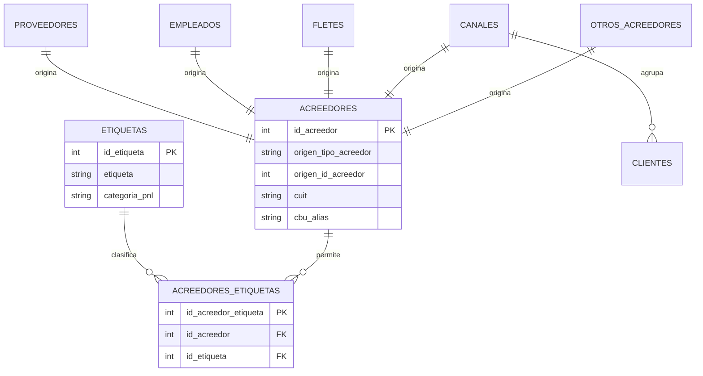

### 7.2 Inventario, recetas y compras

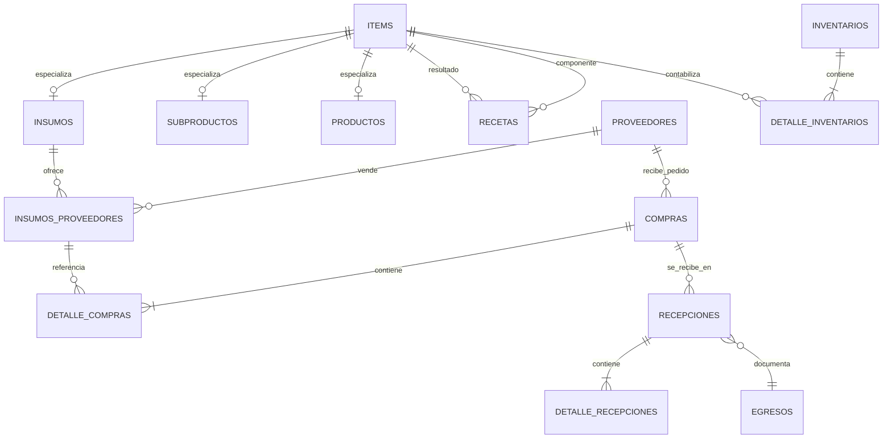

### 7.3 Ventas y cobranzas

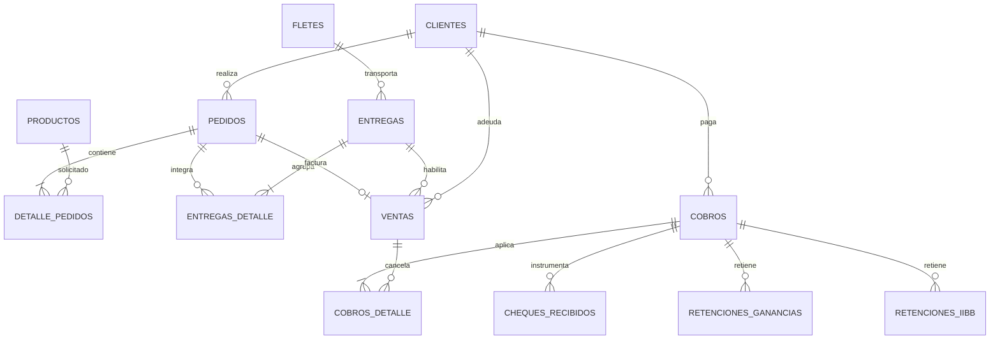

### 7.4 Egresos, pagos y banco

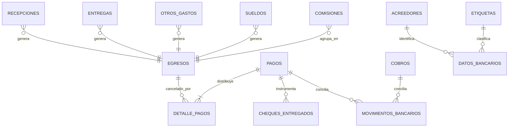

### Regla de diseño esencial

Los módulos operativos registran el **hecho económico**; egresos y ventas registran el **documento financiero**; pagos y cobros registran la **cancelación**; movimientos bancarios registran la **evidencia real de fondos**. No deben duplicarse entre sí ni sustituirse unos por otros.

---

## 8. Auditoría cuantitativa del dato

### 8.1 Resumen

| Métrica | Resultado |
|---|---:|
| Tablas auditadas | 39 |
| Filas totales | 67.567 |
| Tablas sin filas | 3 |
| Columnas completamente vacías | 29, incluyendo tablas sin filas |
| Filas completamente vacías | 1 |
| Tablas con PK repetida | 1 (`caja`) |

### 8.2 Tablas sin filas

- `datos_bancarios`
- `movimientos_bancarios`
- `comisiones`

Estas tres tablas corresponden justamente a automatizaciones todavía no cerradas: reconocimiento bancario, memoria de conciliación y devengamiento de comisiones.

### 8.3 Columnas completamente vacías en tablas con datos

| Tabla | Filas | Columna vacía | Impacto |
|---|---:|---|---|
| `etiquetas` | 33 | `categoria_pnl` | El estado de resultados no puede gobernarse desde la tabla maestra. |
| `entregas` | 575 | `id_acreedor_etiqueta` | La clasificación logística depende de un valor por defecto. |
| `otros_gastos` | 5.526 | `id_acreedor_etiqueta` | La categoría puede reconstruirse, pero no está formalmente persistida. |
| `sueldos` | 968 | `id_egreso` | No existe trazabilidad directa entre liquidación y factura/egreso. |

### 8.4 Relaciones rotas o incompletas

| Relación | Problema |
|---|---:|
| `acreedores_etiquetas.id_etiqueta → etiquetas.id_etiqueta` | 25 filas huérfanas |
| `insumos_proveedores.id_proveedor → proveedores.id_proveedor` | 28 filas vacías |
| `detalle_pedidos.id_producto → productos.id_producto` | 4 filas huérfanas |
| `entregas.id_flete → fletes.id_flete` | 1 fila vacía |
| `entregas_detalle.id_entrega → entregas.id_entrega` | 2 filas vacías |
| `detalle_recepciones.id_recepcion` | 1 fila vacía |
| `detalle_recepciones.id_insumo` | 1 fila vacía |
| `egresos.id_etiqueta → etiquetas.id_etiqueta` | 7.227 filas vacías |
| `detalle_pagos.id_egreso → egresos.id_egreso` | 138 filas vacías |

### 8.5 Posibles duplicados de negocio

No todos son necesariamente errores; deben revisarse con sus detalles.

| Tabla | Criterio | Grupos | Filas afectadas |
|---|---|---:|---:|
| `sueldos` | empleado + período | 93 | 193 |
| `pedidos` | cliente + fecha pedido + fecha entrega | 38 | 77 |
| `cobros_detalle` | cobro + venta | 8 | 22 |
| `egresos` | fecha + número + total | 5 | 10 |
| `cheques_recibidos` | número + banco | 4 | 8 |
| `detalle_pagos` | pago + egreso | 2 | 4 |

### 8.6 Saldos financieros

#### Egresos

- Total cargado: **$ 1.031.837.830,91**.
- Total aplicado en pagos: **$ 895.809.651,95**.
- Saldo positivo pendiente: **$ 190.053.610,61**.
- Documentos pendientes: **1.263**.
- Documentos sobrepagados: **95**, por **$ 54.025.431,64**.
- Diferencias aritméticas directas: 1 egreso, ID 2091.

La suma de pagado y saldo positivo supera el total porque los sobrepagos se informan por separado. Es imprescindible resolverlos antes de usar la deuda total como cifra contable definitiva.

#### Ventas

- Total cargado: **$ 1.217.281.500,17**.
- Total aplicado en cobros: **$ 1.129.915.440,46**.
- Saldo pendiente: **$ 88.545.862,32**.
- Ventas pendientes: **72**.
- Una venta sobrecobrada por **$ 1.179.802,61**.
- 537 diferencias entre subtotal, IVA y total.

### 8.7 Inventario

| Indicador | Valor |
|---|---:|
| Inventarios | 1.706 |
| Detalles | 30.186 |
| Mediana de valor total | $ 27.075.153,56 |
| Percentil 95 | $ 43.818.552,03 |
| Máximo | $ 3.973.476.470,93 |
| Detalles con cantidad y costo unitario cero | 761 |

#### Inventarios extremos detectados

| ID | Fecha | Turno | Valor |
|---:|---|---|---:|
| 907 | 15/04/2025 | Madrugada | $ 3.973.476.470,93 |
| 913 | 17/04/2025 | Madrugada | $ 2.869.102.989,52 |
| 859 | 20/03/2025 | Madrugada | $ 830.440.024,13 |
| 868 | 26/03/2025 | Madrugada | $ 246.351.032,04 |
| 28 | 05/07/2023 | Mañana con problema de codificación | $ 154.395.261,18 |

Los dos primeros superan más de cien veces la mediana y explican resultados mensuales absurdos. Deben auditarse a nivel de detalle, unidad y precio fuente.

### 8.8 Enlaces de fuentes económicas a egresos

| Fuente | Filas | Con egreso | Sin egreso |
|---|---:|---:|---:|
| Recepciones | 188 | 188 | 0 |
| Entregas | 575 | 573 | 2 |
| Otros gastos | 5.526 | 5.526 | 0 |
| Sueldos | 968 | 0 | 968 |
| Comisiones | 0 | 0 | 0 |

Además, 1.517 egresos no pueden rastrearse en sentido inverso a una de las fuentes económicas actuales. Parte puede ser historia previa a la nueva estructura, pero requiere una tabla de migración o marca de “legado” explícita.

---

## 9. Errores y riesgos priorizados

### P0 — Corregir antes de confiar en resultados financieros

#### 1. Valuación extrema de inventario

**Impacto:** altera costo de mercadería, utilidad bruta, utilidad neta, porcentajes y comparaciones.

**Causa probable:** combinación incorrecta entre unidad de conteo, cantidad de receta, precio unitario o multiplicación repetida en productos/subproductos.

**Acción:** auditar los detalles de inventarios 907, 913, 859 y 868; registrar para cada línea `precio_fuente`, `unidad_precio` y `formula_valorizacion`.

#### 2. Fuente de verdad dividida

**Impacto:** pérdida silenciosa de cambios al refrescar.

**Acción:** adoptar una base transaccional única. Google Sheets debe ser importación/exportación; el caché, solo una proyección regenerable.

#### 3. Etiquetas y P&L sin gobierno maestro

**Impacto:** una modificación de texto puede sacar un gasto del estado de resultados.

**Acción:** completar `categoria_pnl`, reparar relaciones huérfanas y hacer que el reporte use el ID/categoría maestra, no listas de nombres.

#### 4. Saldos sobrepagados y sobrecobrados

**Impacto:** deuda, caja y cashflow incorrectos.

**Acción:** bloquear aplicaciones que excedan saldo, salvo nota de crédito o anticipo documentado.

### P1 — Corregir para cerrar circuitos operativos

#### 5. Sueldos duplicados y sin egreso

Crear clave única por empleado-período y separar novedades de liquidaciones.

#### 6. Banco sin memoria persistente

Poblar movimientos y reglas bancarias. Definir identificador idempotente por banco, fecha, concepto, importe, saldo y referencia.

#### 7. Cashflow con fecha fija — corregido

El reporte ya usa la fecha actual del servidor en zona horaria de Argentina. Queda como mejora opcional permitir una fecha de corte elegida por el usuario.

#### 8. Relaciones incompletas

Resolver FKs vacías y evitar guardar nuevas filas sin relación obligatoria.

#### 9. Ventas con composición monetaria ambigua

Definir formalmente:

`total = subtotal + IVA + percepciones - retenciones`, indicando qué retenciones pertenecen a la factura y cuáles al cobro.

### P2 — Reducir riesgo técnico y tiempo de cambio

#### 10. Archivos monolíticos

Separar por dominio sin cambiar la experiencia visual:

- `modules/inventory.js`
- `modules/purchases.js`
- `modules/sales.js`
- `modules/treasury.js`
- `modules/payroll.js`
- `reports/income-statement.js`
- `reports/cashflow.js`
- `shared/formatters.js`
- `shared/api.js`

#### 11. Normalización que modifica datos al leer

Las migraciones deberían ser explícitas, versionadas y ejecutadas una vez. El refresco no debería “reparar” silenciosamente la historia en cada lectura.

#### 12. Ausencia de pruebas automatizadas de negocio

No hay una suite que garantice fórmulas, saldos, unidades o idempotencia. Es la mayor causa probable de regresiones después de cambios pequeños.

#### 13. Problemas de codificación

Se observan textos como `Mañana` y archivos con caracteres deformados. Estandarizar UTF-8 en archivos, consola, importaciones y respuestas HTTP.

---

## 10. Modelo objetivo recomendado

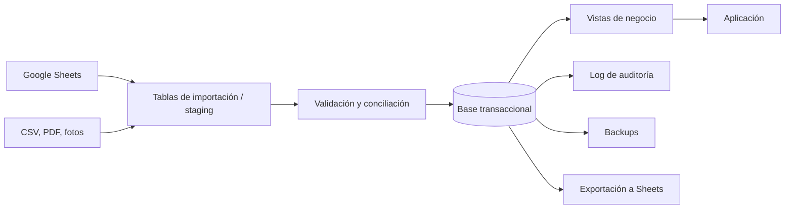

### Base recomendada

- **SQLite** si siempre habrá un único servidor y pocos usuarios concurrentes.
- **PostgreSQL** si se usará desde varias computadoras/celulares al mismo tiempo o se publicará fuera de la red local.

El caché JSON puede mantenerse como acelerador, pero nunca como única persistencia de operaciones.

### Tablas auxiliares necesarias

1. `importaciones`: fuente, fecha, versión, estado y errores.
2. `importaciones_filas`: fila original y resultado de validación.
3. `auditoria_cambios`: usuario, fecha, tabla, ID, antes y después.
4. `archivos_adjuntos`: archivo, hash, tipo, entidad e ID.
5. `cuentas_financieras`: bancos, efectivo, fondos y billeteras.
6. `movimientos_financieros`: transferencias internas, fondos, cheques y banco.
7. `migracion_legacy`: relación entre IDs históricos y nuevos.

### Vistas auditables sugeridas

- `vw_saldos_egresos`
- `vw_saldos_ventas`
- `vw_estado_resultados_mensual`
- `vw_estado_resultados_detalle`
- `vw_inventario_valorizado`
- `vw_inventario_alertas`
- `vw_cashflow_4_semanas`
- `vw_conciliacion_bancaria`
- `vw_trazabilidad_egreso`
- `vw_trazabilidad_venta`

Estas vistas evitan información oculta: cada total debe poder abrirse hasta llegar a sus filas fuente.

---

## 11. Reglas transversales recomendadas

### IDs y relaciones

- PK obligatoria y única en toda tabla transaccional.
- FK obligatoria cuando el proceso la necesita.
- IDs generados por la base, no por `máximo + 1` en el navegador.
- Restricciones únicas por documento y operación para evitar dobles envíos.

### Importaciones

- Nunca reemplazar una tabla válida por una importación defectuosa.
- Tampoco conservar datos viejos sin mostrar claramente su antigüedad.
- Guardar hash de cada fuente para saber si realmente cambió.
- Mostrar altas, bajas y modificaciones antes de confirmar.

### Montos

- Guardar moneda y escala fija.
- No usar valores formateados como texto para calcular.
- Mantener separado subtotal, IVA, percepciones, retenciones y total.
- Redondear solo en presentación; conservar precisión interna.

### Fechas

- Formato interno ISO `YYYY-MM-DD`.
- Fecha de documento, fecha efectiva, fecha prevista y fecha de pago no deben confundirse.
- Todo reporte debe exponer su fecha de corte.

### Archivos

- Guardar copia controlada, no solo ruta temporal.
- Registrar hash para evitar adjuntos duplicados.
- Enlazar cada archivo a la entidad y operación correspondiente.

### Auditoría

- Toda edición manual debe dejar usuario, fecha, valor anterior y nuevo.
- Toda regla automática debe indicar por qué completó un valor.
- Toda cifra agregada debe poder abrir su detalle.

---

## 12. Hoja de ruta propuesta

### Fase 0 — Resguardo y congelamiento de criterios

1. Copiar caché y archivos fuente actuales.
2. Documentar fórmulas contables vigentes.
3. Congelar cambios masivos hasta corregir inventario.

### Fase 1 — Calidad crítica

1. Corregir inventarios extremos.
2. Reparar `acreedores_etiquetas` y completar `categoria_pnl`.
3. Resolver sobrepagos/sobrecobros.
4. Eliminar filas vacías y FKs obligatorias vacías.
5. Deduplicar sueldos con criterio documentado.

### Fase 2 — Fuente única

1. Crear base transaccional.
2. Migrar maestros.
3. Migrar compras/recepciones/inventario.
4. Migrar pedidos/ventas/cobros.
5. Migrar egresos/pagos/cheques.
6. Dejar Sheets como interfaz de intercambio.

### Fase 3 — Cierre financiero

1. Persistir comisiones.
2. Persistir movimientos bancarios y reglas.
3. Rehacer cashflow con fecha de corte dinámica.
4. Validar P&L contra meses cerrados manualmente.
5. Crear conciliación de saldos inicial/final por cuenta.

### Fase 4 — Modularización y pruebas

1. Separar dominios de `app.js` y `server.js` de manera gradual.
2. Añadir pruebas unitarias de fórmulas.
3. Añadir pruebas de flujo completo.
4. Añadir verificación automática de integridad al refrescar.

---

## 13. Pruebas mínimas de aceptación

### Estado de Resultados

- Un mes cerrado coincide con cálculo manual.
- Cada total abre el detalle completo.
- Inventario inicial toma el último turno anterior disponible.
- Ingresos Brutos aplica 1,5 % solo a A/B.
- Comisiones se calculan sobre subtotal proporcional cobrado.

### Inventario

- No se puede guardar fecha-turno duplicado.
- No se puede valorizar sin unidad y costo fuente explícitos.
- Una variación extrema pide confirmación.
- Productos y subproductos incluyen todos sus componentes de receta.

### Compras y pagos

- No existe recepción sin compra.
- No existe detalle sin cabecera.
- Un pago no supera el saldo salvo operación especial.
- Un cheque entregado siempre referencia un pago con método cheque.

### Ventas y cobros

- Un cobro parcial distribuye proporcionalmente subtotal e impuestos.
- Las retenciones quedan separadas del dinero efectivamente recibido.
- Una factura no puede quedar sobrecobrada sin anticipo o nota de crédito.

### Banco

- Reimportar el mismo extracto no duplica movimientos.
- Transferencias internas no generan gasto ni ingreso.
- Un movimiento conciliado conserva su vínculo y explicación.
- Saldo teórico final coincide con saldo bancario del extracto.

---

## 14. Indicadores de salud sugeridos

El Dashboard debería incorporar un bloque pequeño de “Calidad de datos” con:

- última actualización exitosa;
- fuentes con error;
- relaciones huérfanas;
- filas sin clasificación P&L;
- pagos/cobros sobreaplicados;
- inventarios fuera de rango;
- operaciones pendientes de conciliación;
- hechos operativos sin documento financiero;
- documentos sin pago/cobro;
- adjuntos faltantes.

Esto transforma errores silenciosos en tareas operativas visibles.

---

## 15. Decisión recomendada

No conviene rehacer toda la interfaz. La experiencia construida ya expresa bien los procesos reales de la empresa. Conviene:

1. estabilizar primero inventario, etiquetas y saldos;
2. definir una base de datos como fuente única;
3. migrar los circuitos por módulos;
4. conservar las pestañas y formularios actuales;
5. reemplazar progresivamente las lecturas del caché por vistas auditables;
6. usar Google Sheets como integración, no como base paralela.

La app está cerca de ser una herramienta operativa muy valiosa, pero para convertirse en un ERP confiable debe pasar de “pantallas que reconstruyen la realidad” a “transacciones persistentes que prueban la realidad”. Esa es la mejora estructural que más simplificará la carga, reducirá errores y hará confiables los reportes.

---

## Anexo A — Conteo actual de tablas

| Tabla | Filas |
|---|---:|
| etiquetas | 33 |
| acreedores | 86 |
| otros_acreedores | 19 |
| acreedores_etiquetas | 182 |
| proveedores | 25 |
| clientes | 47 |
| empleados | 25 |
| canales | 7 |
| fletes | 10 |
| datos_bancarios | 0 |
| movimientos_bancarios | 0 |
| items | 124 |
| productos | 46 |
| subproductos | 24 |
| insumos | 54 |
| insumos_proveedores | 55 |
| recetas | 164 |
| pedidos | 1.006 |
| detalle_pedidos | 1.037 |
| entregas | 575 |
| entregas_detalle | 1.007 |
| ventas | 1.024 |
| cobros | 778 |
| cobros_detalle | 1.215 |
| caja | 40 |
| cheques_entregados | 54 |
| cheques_recibidos | 589 |
| compras | 188 |
| detalle_compras | 202 |
| recepciones | 188 |
| detalle_recepciones | 203 |
| otros_gastos | 5.526 |
| egresos | 7.803 |
| pagos | 5.804 |
| detalle_pagos | 6.567 |
| comisiones | 0 |
| sueldos | 968 |
| inventarios | 1.706 |
| detalle_inventarios | 30.186 |

## Anexo B — Evidencias técnicas clave

- Reporte de cashflow y fecha fija: `server.js`, función `buildBackendCashflowReport`.
- Estado de resultados: `server.js`, función `buildBackendIncomeStatementReport`.
- Fuentes económicas: `server.js`, función `backendEconomicExpenseRows`.
- Refresco y conservación de tablas anteriores: `server.js`, función `handleBackendRefresh`.
- Editor que persiste en caché: `server.js`, función `handleBackendTableSave`.
- Normalización integral del caché: `server.js`, función `finalizeBackendCache`.
- Auditoría reproducible: `tools/audit-erp-data.js`.

## Anexo C — Observaciones que requieren criterio humano

1. Los 38 pedidos con igual cliente y fechas pueden ser legítimos si contienen productos distintos.
2. Los cobros parciales repetidos contra una venta pueden ser correctos, pero necesitan una regla de suma y un identificador claro.
3. Los egresos históricos sin fuente inversa pueden pertenecer al modelo anterior y no deben borrarse sin migración.
4. Las 537 diferencias de ventas pueden explicarse por percepciones o retenciones eliminadas del nuevo esquema.
5. Las relaciones acreedor-etiqueta huérfanas no deben reasignarse automáticamente hasta recuperar la solapa correcta.
6. Los 761 items con costo cero pueden incluir items sin valor, pero cada caso debe tener una razón explícita.
